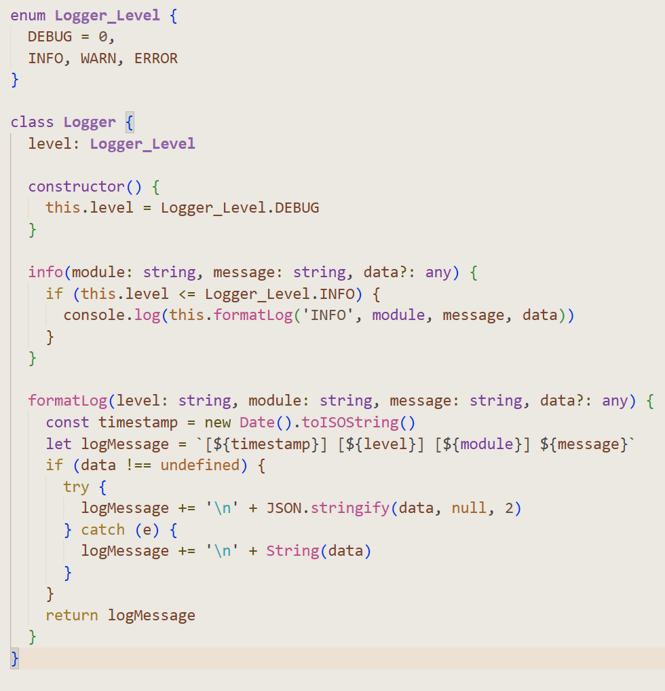

# 🪶 Parchment Theme for Visual Studio Code

A warm, vintage-inspired Visual Studio Code theme designed to evoke the feel of parchment paper and classic script. Ideal for developers who prefer an elegant, soft-toned, and distraction-free environment.

---

## ✨ Features

- 📜 Handcrafted parchment-style color palette
- ✒️ Custom syntax highlighting for HTML, CSS, JavaScript, Vue, and more
- 🪶 Smooth tones inspired by aged paper, ink, and natural materials
- 🎨 Subtle shadows and warm contrasts for minimal eye strain
- 📦 Includes custom icons and status bar styling

---

## 🌈 Preview



---

## 📦 Installation

1. Open **Extensions** in VS Code (`Ctrl+Shift+X`)
2. Search for **Parchment Theme**
3. Click **Install**
4. Open the Command Palette (`Ctrl+Shift+P`) and choose:  
   `Preferences: Color Theme` → Select **Parchment Theme**

## 🛠 Customization

You can fine-tune the theme using your `settings.json`:

```jsonc
"workbench.colorCustomizations": {
   "[Parchment Theme]": {
      "activityBarBadge.background": "#b09764",
      "statusBarItem.remoteBackground": "#a18560",
      "list.activeSelectionBackground": "#d9c7a6"
   }
}
```
